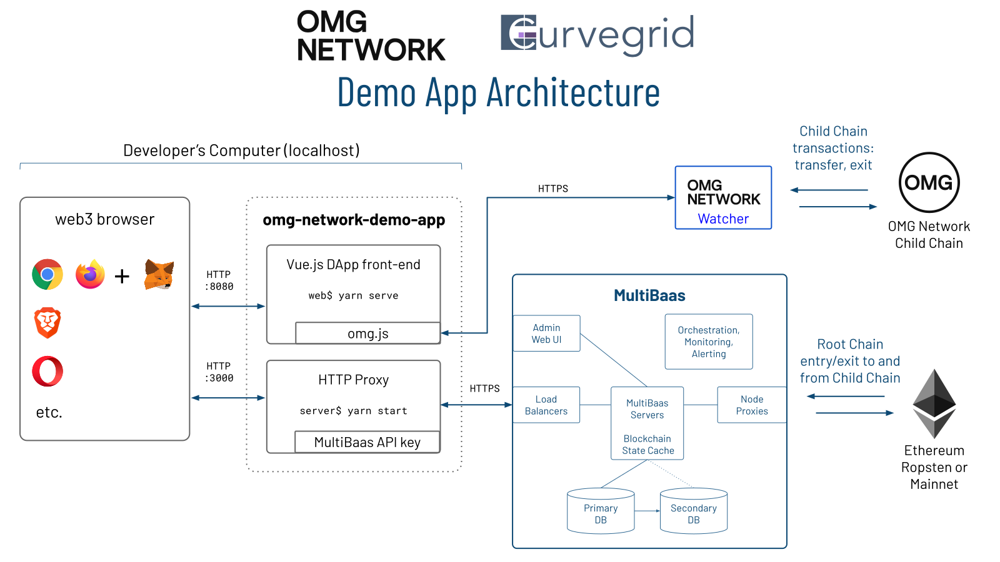
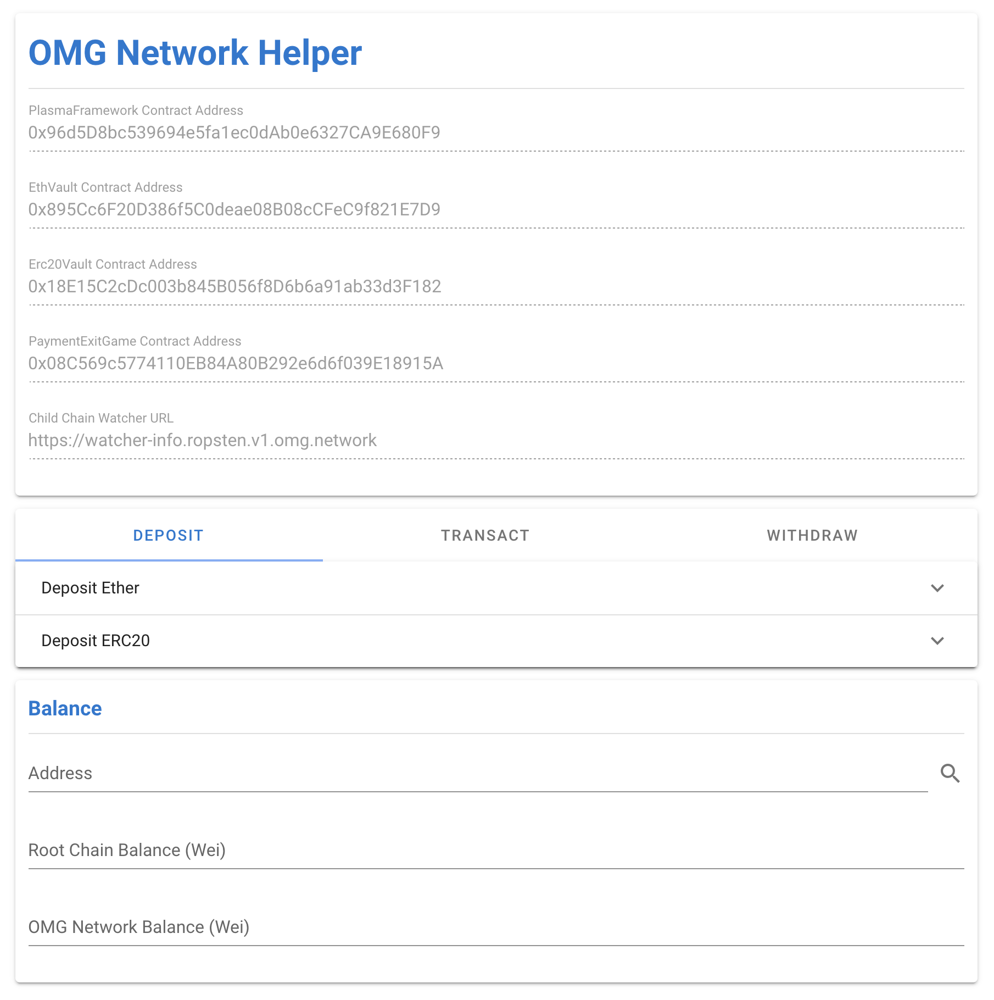
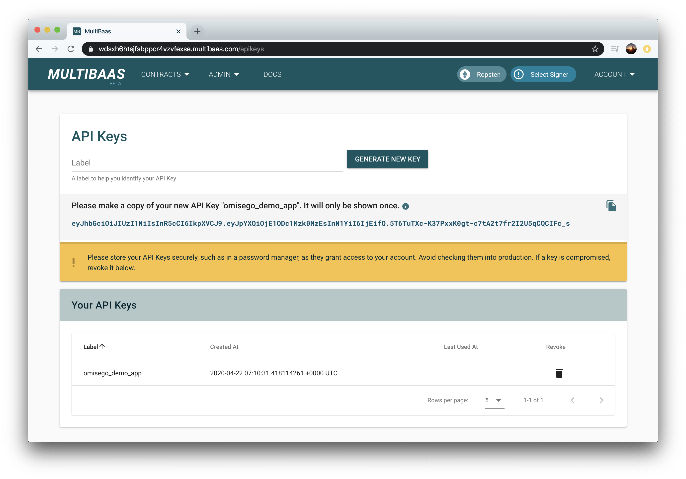
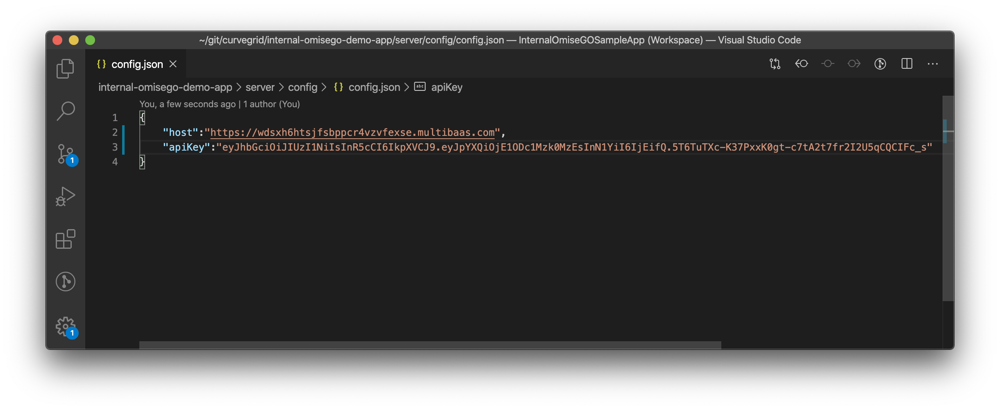

# OMG Network with MultiBaas Demo App

MultiBaas provides a simple interface for interacting with smart contracts on the Ethereum network, and it can also simplify building on the OMG Network. This demo application can be used as a starting point for building a DApp on the OMG Network with MultiBaas.

This demo app is built on [Vue.js](https://vuejs.org/), with custom JavaScript for interacting with the MultiBaas blockchain middleware and OMG Network child chain. At this point, composing transactions requires the `omg-js` library, which the front-end calls. In the near future, MultiBaas will add back-end support for composing OMG Network transactions directly, much as it does for Ethereum.

MultiBaas requires TLS/SSL (HTTPS), and so we use a basic HTTP-to-HTTPS proxy for development purposes on localhost. The MultiBaas API key sits in the proxy server.

Here's a screenshot of the demo app running in a web browser:

# Dependencies
- [node.js](https://nodejs.org/)
- [vue-cli](https://cli.vuejs.org/)
- [yarn](https://yarnpkg.com/) or [npm](https://www.npmjs.com/)

# Requirements
- [MultiBaas Ropsten Deployment](https://www.curvegrid.com/docs/3-0-getting-started-creating-a-multibaas-deployment/)

# Setup
1. Run `yarn install` in both the `server` and `web` directories
2. Create an API key on your MultiBaas Ropsten deployment
3. In your MultiBaas deployment, ensure that the `Erc20Vault`, `EthVault`, `PaymentExitGame` and `PlasmaFramework` contracts are linked to their Ropsten addresses as detailed by [OMG](https://docs.omg.network/network-connection-details).

4. Copy the the `server/config/sample-config.json` file to `server/config/config.json`, enter the base URL of your MultiBaas deployment and the API key you created, and remove the comments at the top of the file. Be careful not to check your API credentials into Github or another source control system.

5. Run `yarn start` in the `server` directory to start the backend proxy
6. Run `yarn serve` in the `web` to start the frontend app
